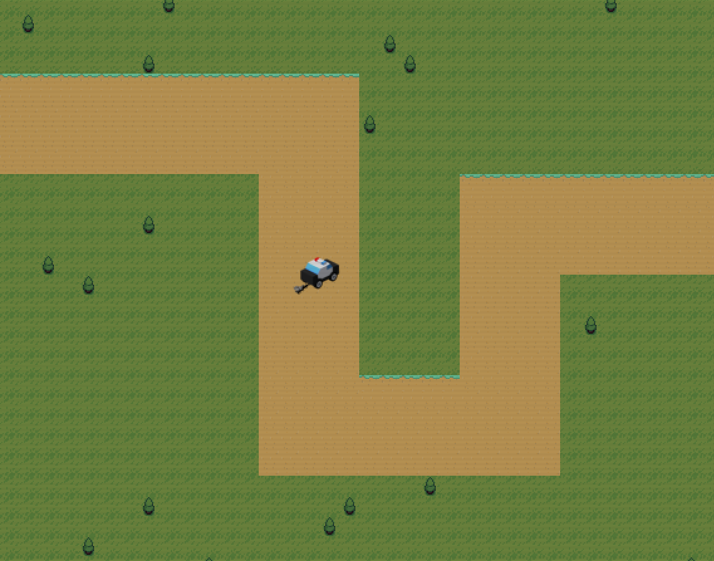

# car_racing_game
Demonstration of a simple working car racing game engine with track generation and terrain

Working car racing simple 2D engine that generates a track and surrounding terrain. The car is controlled with the arrow keys and movement slows when leaving the track, made with golang/go and raylib.
  

